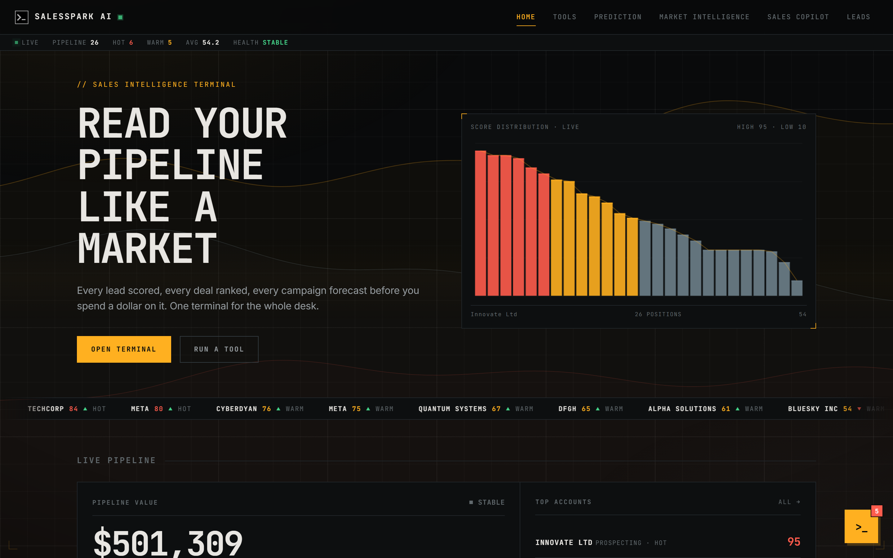
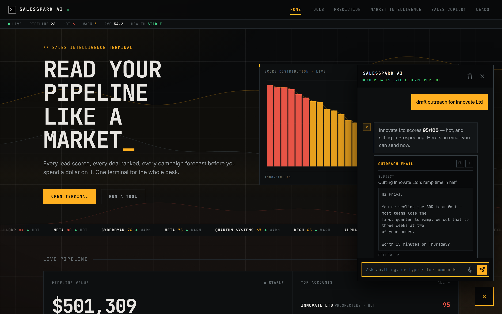
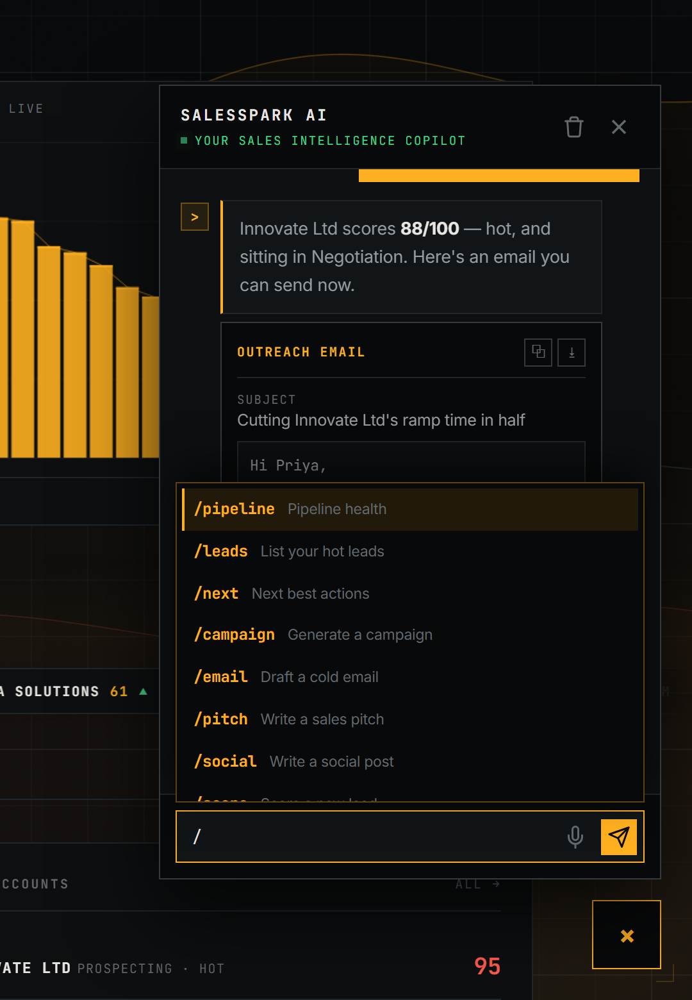
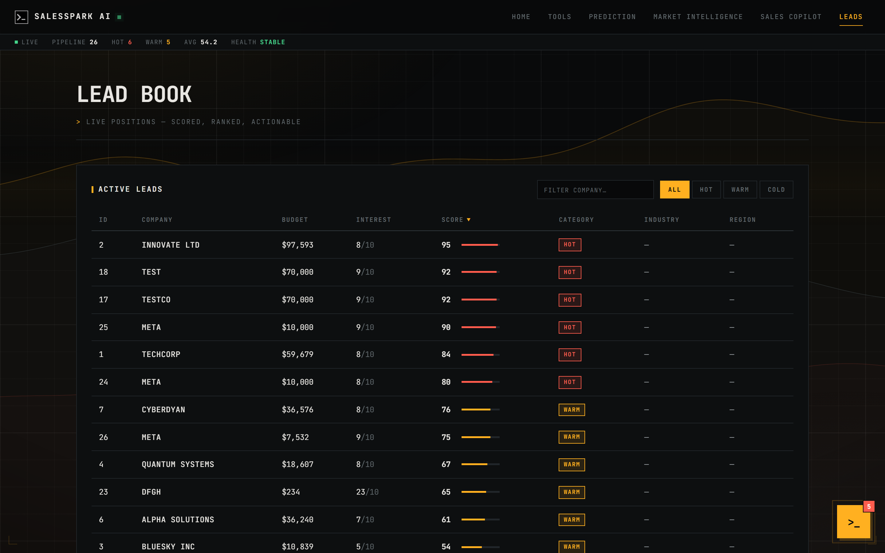
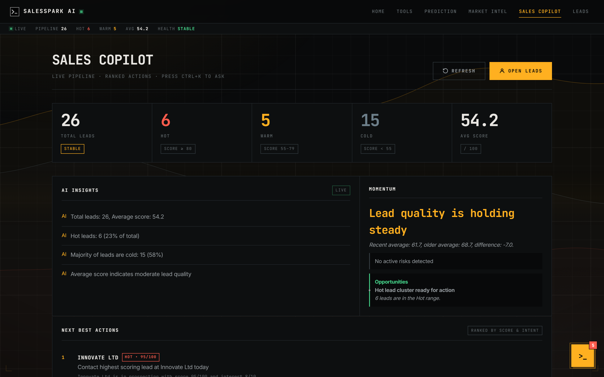
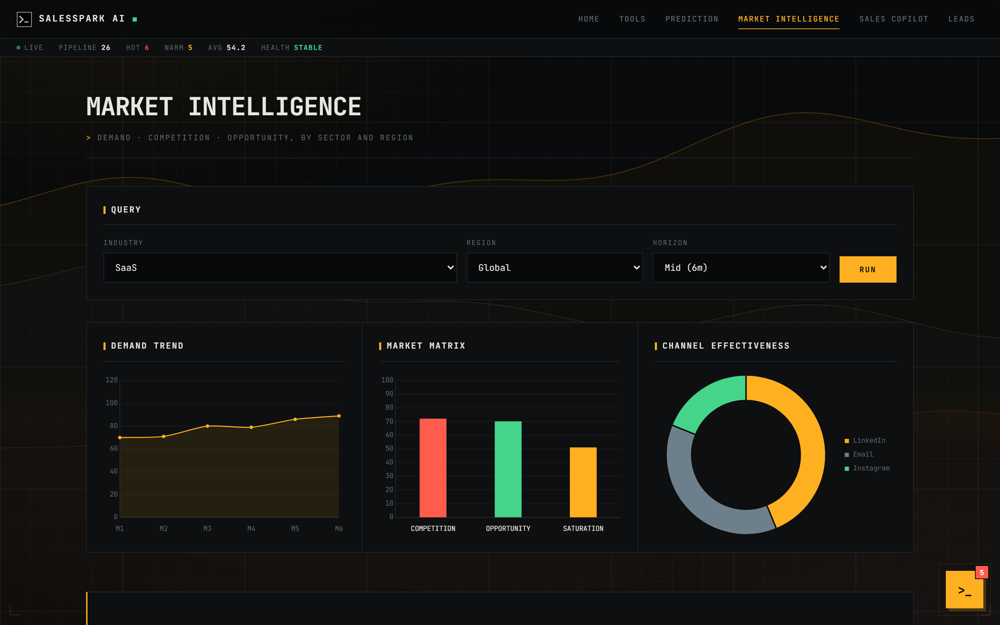
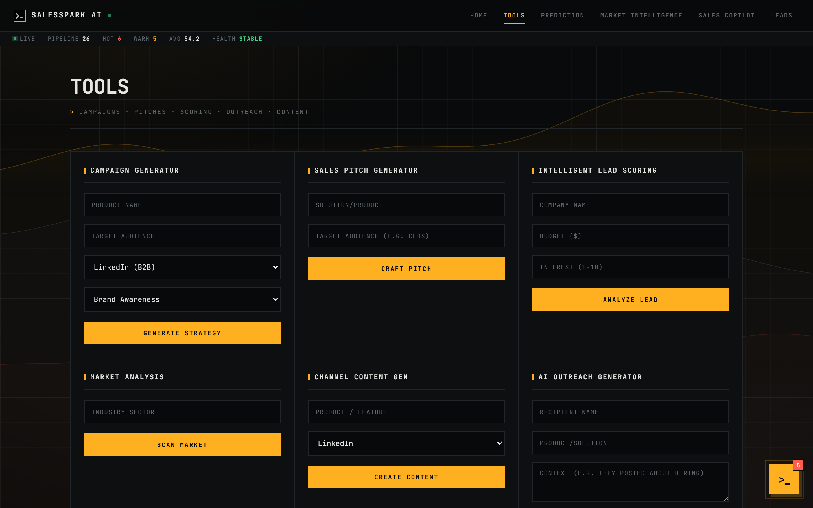

# SalesSpark AI

**A sales intelligence terminal.** Every lead scored, every deal ranked, every campaign forecast — with an AI copilot that can run the whole thing for you from a chat box.



---

## What it is

SalesSpark AI scores your pipeline, tells you who to call next, and drafts the outreach when you get there. It is a FastAPI backend over SQLite, a vanilla-JS frontend with no build step, and a Groq-hosted Llama 3.3 agent wired into both.

The copilot is not a chat wrapper around a search box. It is a **tool-calling agent with 13 tools** — it can read your live pipeline, score a lead, plan a close, forecast a campaign, write the email, and navigate you to the right page, all inside one conversation.

---

## Screenshots

### The copilot

Ask in plain English. The agent picks its own tools, streams its answer token by token, and returns generated assets as cards you can copy or download.



### Slash commands

Type `/` — or hit <kbd>Ctrl</kbd>+<kbd>K</kbd> from anywhere — for the command palette.



### Lead book

Every lead scored 0–100 and bucketed Hot / Warm / Cold. Sortable, filterable, searchable.



### Sales copilot dashboard

Pipeline KPIs, momentum, risks, and a ranked list of next best actions.



### Market intelligence

Demand trend, competition-vs-opportunity matrix, and channel effectiveness by sector and region.



### Generators

Campaigns, pitches, lead scoring, market scans, channel content, and cold outreach.



---

## Features

### AI copilot (agentic)

The copilot streams over SSE and calls tools in a loop until it can answer. Its 13 tools:

| Tool | What it does |
|---|---|
| `analyze_pipeline` | Read live pipeline health |
| `list_leads` | List leads by category |
| `score_lead` | Score a new or existing lead |
| `get_next_actions` | Ranked next best actions |
| `get_deal_strategy` | Closing plan, discount band, objections |
| `get_followup_plan` | Day 1 / 3 / 7 follow-up sequence |
| `predict_campaign` | Forecast engagement and conversion |
| `get_market_intelligence` | Demand, competition, opportunity |
| `generate_campaign` | Multi-channel campaign strategy |
| `draft_email` | Cold outreach email |
| `generate_pitch` | Sales pitch with objection handling |
| `generate_social` | Social post with hashtags |
| `navigate_to_page` | Take the user to a page |

Also:

- **Slash commands** — 14 of them, with <kbd>Ctrl</kbd>+<kbd>K</kbd> to open the copilot from any page.
- **Proactive briefing** — on load the copilot checks your pipeline; if leads need attention it badges itself and hands you the briefing when you open it.
- **Export** — every generated asset can be copied or downloaded as `.txt`.
- **Voice input**, streaming with a stop button, regenerate, and a persisted transcript.

### Elsewhere in the app

- **Lead scoring** — budget, intent, and firmographics into a 0–100 score with a Hot / Warm / Cold band.
- **Deal tools** — closing strategy and follow-up planner, per lead.
- **Campaign prediction** — engagement and conversion probability with a risk level, before you spend.
- **Market intelligence** — optionally grounded in live web search when a Tavily or SerpAPI key is present.

---

## Stack

| Layer | Choice |
|---|---|
| Backend | FastAPI, served by Uvicorn |
| Database | SQLite via raw `sqlite3` (no ORM) |
| AI | Groq — `llama-3.3-70b-versatile`, with function calling and streaming |
| Frontend | Vanilla JS — no bundler, no framework |
| Charts | Chart.js, plus hand-rolled canvas for the hero and background |

The backend serves the frontend too, so there is one process and one origin.

---

## Getting started

**Prerequisites:** Python 3.10+ and a free [Groq API key](https://console.groq.com).

### 1. Clone and install

```bash
git clone https://github.com/murthyroshan/marketmind.git
cd marketmind

python -m venv .venv
source .venv/bin/activate          # Windows: .\.venv\Scripts\Activate.ps1

pip install -r requirements.txt
```

### 2. Add your API key

```bash
cp .env.example .env               # Windows: Copy-Item .env.example .env
```

Then set the key in `.env`:

```env
GROQ_API_KEY=your_api_key_here
```

### 3. Run

```bash
python -m uvicorn backend.main:app --reload
```

Open **http://127.0.0.1:8000**. The database is created and seeded on first start.

### Environment variables

| Variable | Default | Purpose |
|---|---|---|
| `GROQ_API_KEY` | — | **Required.** Without it, the AI features return a configuration notice. |
| `CORS_ORIGINS` | `http://localhost:8000,http://127.0.0.1:8000` | Comma-separated allowed origins. |
| `TAVILY_API_KEY` | — | Grounds market intelligence in live web search. |
| `SERPAPI_API_KEY` | — | The same, as an alternative to Tavily. |

> **On rate limits:** Groq's free tier has a daily token budget. When it runs out the copilot says so plainly instead of failing silently, and the rest of the app — scores, dashboards, tables — keeps working, since it reads from the database rather than the model.

---

## API

Everything is served from the same origin as the frontend.

**Generation**

| Method | Route | Purpose |
|---|---|---|
| `POST` | `/campaigns` | Generate a campaign strategy |
| `POST` | `/pitch` | Generate a sales pitch |
| `POST` | `/social` | Generate a social post |
| `POST` | `/email` | Draft a cold outreach email |

**Pipeline**

| Method | Route | Purpose |
|---|---|---|
| `GET` | `/leads` | List all leads |
| `POST` | `/leads` | Score and store a new lead |
| `GET` | `/dashboard` | Pipeline KPIs |
| `GET` | `/actions/next` | Ranked next best actions |
| `GET` | `/trends/sales` | Score momentum over time |
| `GET` | `/alerts` | Risks and opportunities |
| `GET` | `/copilot/insights` | Narrative insights |
| `POST` | `/deal/assist` | Closing strategy for a lead |
| `POST` | `/followup/plan` | Follow-up sequence for a lead |

**Intelligence**

| Method | Route | Purpose |
|---|---|---|
| `POST` | `/market/analyze` | Market demand, competition, opportunity |
| `POST` | `/predict/campaign` | Forecast a campaign |

**Copilot**

| Method | Route | Purpose |
|---|---|---|
| `POST` | `/chat/stream` | Streaming agent over SSE — used by the widget |
| `POST` | `/chat` | Non-streaming fallback |
| `GET` | `/health` | Liveness and AI readiness |

---

## Project structure

```
marketmind/
├── backend/
│   ├── main.py            # FastAPI app, routes, SQLite, tool execution
│   ├── ai_service.py      # Groq client, tool schemas, streaming agent loop
│   └── sales.db           # SQLite database (created on first run)
├── css/
│   └── style.css          # The whole design system
├── js/
│   ├── app.js             # Copilot widget, streaming, slash commands, page chrome
│   ├── generators.js      # Campaign / pitch / scoring / market / content
│   ├── deal_tools.js      # Closing strategy + follow-up planner
│   ├── copilot_page.js    # Dashboard
│   ├── market_intelligence.js
│   └── prediction_page.js
├── assets/
├── index.html  tools.html  prediction.html
├── market_intelligence.html  sales_copilot.html  leads.html
└── requirements.txt
```

---

## License

MIT
